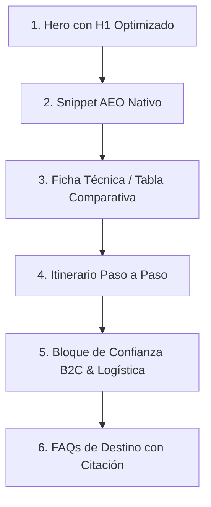

# Playbook de Redacción SEO Moderno, AEO & LLMO (GEO)
## Guía de Optimización de Contenido para Landings de Transfers & Tours Colombia

Este documento sirve como directriz técnica para redactar el contenido de futuras landing pages. Asegura que el texto posicione en motores de búsqueda tradicionales (Google) y sea priorizado, comprendido y citado por motores de respuesta generativa (SearchGPT, Gemini, ChatGPT, Perplexity).

---

## 🏗️ Estructura de Contenido Requerida por Landing

Cada landing page de un tour específico debe estructurarse bajo los siguientes bloques de contenido para cumplir con las directrices SEO, AEO y GEO:

---

## ✍️ Directrices de Redacción por Capas

### Capa 1: AEO (Answer Engine Optimization) - Snippet Nativo
*   **Ubicación:** Inmediatamente debajo del H1 en la sección Hero o al inicio del contenido principal.
*   **Regla de Oro:** Debe responder de manera directa e inequívoca a la pregunta implícita de búsqueda en **2 o 3 líneas (máximo 45-50 palabras)**.
*   **Fórmula:** 
    > "[**Palabra Clave Principal**] es un [tipo de servicio/tour] que consiste en [descripción directa del recorrido] y se caracteriza por [beneficio logístico o diferencial] [Fuente: Organismo de control o estudio]."

### Capa 2: GEO & LLMO (Generative Engine Optimization)
Para que los LLMs extraigan nuestros textos como la fuente más veraz, aplica:
1.  **Citas Fácticas Obligatorias:** Cada dato numérico, recomendación de salud, temporada climática o dato histórico debe acompañarse de su fuente formal en formato `[Fuente: Nombre de Entidad/Estudio]`.
    *   *Fuentes sugeridas para Colombia:* ANATO, MinCIT, ProColombia, IDEAM, Instituto Humboldt, Aerocivil.
2.  **Escaneabilidad Extrema (Chunking):**
    *   Párrafos de **máximo 3 líneas**.
    *   Uso de **negritas** únicamente en entidades, palabras clave secundarias y datos clave (números, meses, horas).
3.  **Lenguaje Factual y Objetivo:** 
    *   **Prohibido:** Usar adjetivos vacíos ("la experiencia más increíble", "el operador líder", "vistas espectaculares").
    *   **Permitido:** Datos concretos ("transporte privado en vans con capacidad de hasta 14 pasajeros", "guiado por profesional con tarjeta del MinCIT").

### Capa 3: EEAT (Experiencia, Autoridad, Confianza)
Demuestra conocimiento práctico que una IA convencional no podría inventar:
*   **Logística Real:** Menciona tiempos de trayecto realistas, estado de vías y consejos sobre cómo evitar multitudes (ej: "Subir a Monserrate antes de las 9:00 AM").
*   **Cumplimiento Legal:** Menciona explícitamente el **Registro Nacional de Turismo (RNT)** y el cumplimiento del Decreto 2438 de 2010 (normativas de agencias de viajes en Colombia) o similares.

---

## 📝 Plantilla de Redacción (Boilerplate)

Usa esta plantilla como base para rellenar el contenido de cualquier nuevo tour:

### 1. Encabezados y Metadatos
*   **Meta-Title:** `Tour [Destino] [Días] Días desde [Ciudad de Origen] | [Nombre de la Marca]` (Menos de 60 caracteres).
*   **Meta-Description:** `Reserva el circuito a [Destino]. Incluye [Atractivo 1], [Atractivo 2] y traslados privados con operador directo con RNT activo. ¡Reserva B2C en minutos!` (Menos de 155 caracteres).
*   **H1:** `Tour a [Destino] [Días] Días: Circuitos Privados y Logística Local` (Debe incluir la palabra clave de mayor intención).

### 2. Párrafo de Apertura (AEO Snippet)
> "El **tour a [Destino]** es un circuito turístico organizado de [X] días que conecta [Punto A] con [Punto B], especializado en [tipo de experiencia, ej: ecoturismo / historia colonial]. Este itinerario integra transporte terrestre privado, hospedaje y guiado certificado [Fuente: Registro Nacional de Turismo de Colombia]."

### 3. Ficha Técnica / Tabla de Especificaciones (GEO/LLMO)
| Especificación | Detalle de Servicio | Fuente de Estándar / Regulación |
| :--- | :--- | :--- |
| **Duración total** | [X] días / [Y] noches. | Plan de viaje certificado |
| **Tipo de servicio** | Privado / Compartido / B2B. | Términos y condiciones del operador |
| **Transporte terrestre** | Vehículos climatizados con placa pública de turismo. | Ministerio de Transporte de Colombia |
| **Registro de operador** | RNT N° [Tu Número de RNT]. | Ministerio de Comercio, Industria y Turismo |

### 4. Preguntas Frecuentes Estructuradas (FAQ)
*   **¿Cuál es la mejor temporada para realizar el tour a [Destino]?**
    *   *Respuesta:* La época recomendada es durante los meses de [Mes] a [Mes], debido a la reducción histórica de lluvias en la región [Fuente: IDEAM].
*   **¿Qué requisitos de ingreso o vacunas se solicitan para este destino?**
    *   *Respuesta:* Se requiere la vacuna de [Nombre de vacuna] si se desciende de los 2,300 metros sobre el nivel del mar [Fuente: Ministerio de Salud de Colombia].

---

## 🔍 Checklist de Auditoría (Antes de publicar)

Antes de pasar el texto a código HTML, verifica que cumpla el 100% de esta lista:

*   [ ] **Prohibido el uso de asteriscos (`**`) en HTML:** ¿Se cambiaron todos los marcadores de negrita `**` por etiquetas `<strong>` o `<b>` nativas?
*   [ ] ¿El H1 contiene la palabra clave principal de alta intención de búsqueda?
*   [ ] ¿Las primeras 3 líneas definen directamente el tour de forma apta para voz/snippets?
*   [ ] ¿Hay al menos 3 placeholders de datos duros con su fuente institucional `[Fuente: ...]`?
*   [ ] **Veracidad y Coherencia de Fuentes:** ¿Las fuentes citadas corresponden lógicamente al dato? (Ej. usar ANATO, IDEAM, Alcaldías o el administrador oficial del atractivo; no citar entidades no relacionadas como IPSE para minas o ministerios para tiempos de Waze).
*   [ ] ¿Todos los párrafos tienen 3 líneas o menos?
*   [ ] ¿Se eliminaron palabras subjetivas como "maravilloso", "increíble", "el mejor del mundo"?
*   [ ] ¿Se incluyó el número de RNT del operador (**RNT N° 44180**)?
*   [ ] ¿La calculadora incluye precio total de reserva y política de cancelación de 24h?
*   [ ] ¿Se removieron referencias a guías presenciales si la catedral cuenta con audioguías multilingües autónomas?
*   [ ] ¿Hay una tabla técnica comparativa de servicios?
